# 一、初识Redis

- 高性能的Key-Value服务器
- 多种数据结构
- 丰富的功能
- 高可用分布式支持

## （一）Redis的特性

- 速度快
- 持久化
- 多种数据结构
- 支持多种编程语言
- 功能丰富
- 简单
- 主从复制

### 1.速度快

10w OPS

数据是存储在内存当中，C语言实现（50000 line），单线程


### 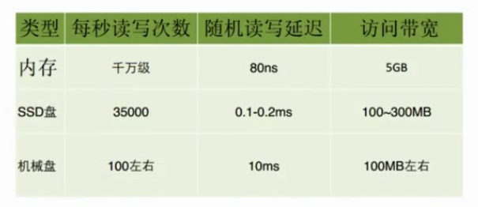

### 2.持久化（断电不丢数据）

Redis所有数据保持在内存中，对数据的更新将异步地保存到磁盘上。

### 3.多种数据结构

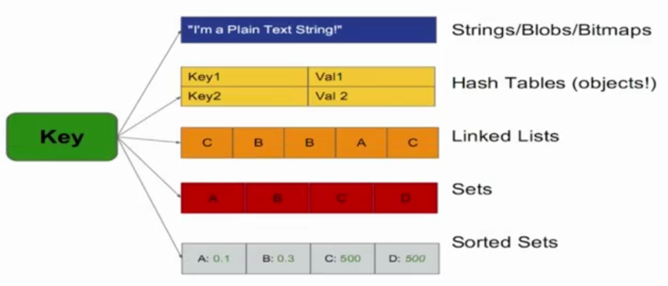

- BitMaps：位图
- HyperLogLog：超小内存唯一值计数
- GEO：地理信息定位

### 4.支持多种客户端语言

- java
- php
- python
- ruby
- lua
- node

### 5.功能丰富

- 发布订阅
- Lua脚本
- 事务
- pipeline

### 6.简单

- 不依赖外部库（like libevent）
- 单线程模型

### 7.主从复制

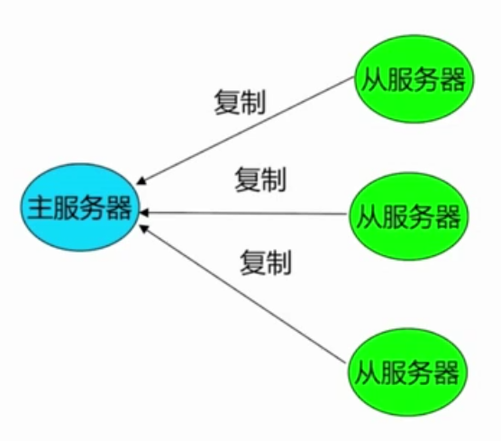

### 8.高可用、分布式


## （二）Redis典型应用场景

- 缓存系统
- 计数器
- 消息队列系统
- 排行榜
- 社交网络
- 实时系统

### 1.缓存系统


### 2.计数器


### 3.消息队列系统


### 4.排行榜


### 5.社交网络


## （三）Redis的三种启动方式介绍

### 1.Linux安装

- wget http://download.redis.io/releases/redis-3.0.7.tar.gz
- tar -xzf redis-3.0.7.tar.gz
- ln -s redis-3.0.7 redis
- cd redis
- make && make install

### 2.Redis可执行文件说明

| 文件             | 说明                    |
| ---------------- | ----------------------- |
| redis-server     | Redis服务器             |
| redis-cli        | Redis命令行客户端       |
| redis-benchmark  | Redis性能测试工具       |
| redis-check-aof  | AOF文件修复工具         |
| redis-check-dump | RDB文件检查工具         |
| redis-sentinel   | Sentinel服务器(2.8以后) |

### 3.三种启动方法

- 最简启动
- 动态参数启动
- 配置文件启动

#### （1）最简启动

- redis-server

> 验证
>
> ps -ef | grep redis
>
> netstat -antpl | grep redis
>
> redis-cli -h ip -p port ping

#### （2）动态参数启动

- redis-server --port 6380

#### （3）配置文件启动

- redis-server configPath

#### （4）三种启动方式比较

- 生产环境选择配置启动
- 单机多实例配置文件可以用端口区分开

### 4.Redis客户端连接

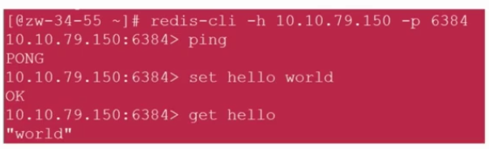

### 5.Redis客户端返回值

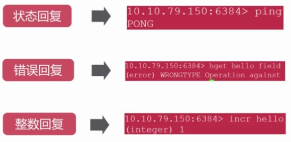


## （四）Redis常用配置

| 配置项    | 说明                    |
| --------- | ----------------------- |
| daemonize | 是否是守护进程(no\|yes) |
| port      | Redis对外端口号         |
| logfile   | Redis系统日志           |
| dir       | Redis工作目录           |
| 6379      | 默认端口                |

# 二、Redis API的使用和理解

## （一）通用命令

| 命令               | 说明               |
| ------------------ | ------------------ |
| keys               | redis中所有的键    |
| dbsize             | redis数据库的大小  |
| exists key         | 判断key是否存在    |
| del key [key...]   | 删除key            |
| expire key seconds | 设置key的有效时间  |
| type key           | 查看 key的数据类型 |

#### 1.keys

```shell
keys *
# 遍历所有key
```

```shell
127.0.0.1:6379> set hello world
OK
127.0.0.1:6379> set php good
OK
127.0.0.1:6379> set java best
OK
127.0.0.1:6379> keys *
1) "java"
2) "php"
3) "hello"
127.0.0.1:6379> dbsize
(integer) 3
```

```shell
keys [pattern]
# 遍历所有key
```

```shell
127.0.0.1:6379> mset hello world hehe haha php good phe his
OK
127.0.0.1:6379> keys he*
1) "hehe"
2) "hello"
127.0.0.1:6379> keys he[h-l]*
1) "hehe"
2) "hello"
127.0.0.1:6379> keys ph?
1) "phe"
2) "php"
```

> ==keys命令一般不在生产环境使用==

> keys*怎么用
>
> - 热备从节点
> - scan

#### 2.dbsize

```shell
dbsize
# 计算key的总数
```

```shell
127.0.0.1:6379> mset k1 v1 k2 v2 k3 v3 k4 v4
OK
127.0.0.1:6379> dbsize
(integer) 4
127.0.0.1:6379> sadd myset a b c d e
(integer) 5
127.0.0.1:6379> dbsize
(integer) 5
```

#### 3.exists

```shell
exists key
# 检查key是否存在
```

```shell
127.0.0.1:6379> set a b
OK
127.0.0.1:6379> exists a
(integer) 1
127.0.0.1:6379> del a
(integer) 1
127.0.0.1:6379> exists a
(integer) 0
```

#### 4.del

```shell
del key
# 删除指定key-value
```

```shell
127.0.0.1:6379> set a b
OK
127.0.0.1:6379> get a
"b"
127.0.0.1:6379> del a
(integer) 1
127.0.0.1:6379> get a
(nil)
```

#### 5.expire、ttl、persist

```shell
expire key seconds
# key在seconds秒后过期
=========================================================================================
ttl key
# 查看可以剩余的过期时间
=========================================================================================
persist key
# 去掉key的过期时间
```

```shell
127.0.0.1:6379> set hello world
OK
127.0.0.1:6379> expire hello 20
(integer) 1
127.0.0.1:6379> ttl hello
(integer) 16
127.0.0.1:6379> get hello
"world"
127.0.0.1:6379> ttl hello
(integer) 7
127.0.0.1:6379> ttl hello
(integer) -2 (-2代表key已经不存在了)
127.0.0.1:6379> get hello
(nil)
=========================================================================================
127.0.0.1:6379> set hello world
OK
127.0.0.1:6379> expire hello 20
(integer) 1
127.0.0.1:6379> ttl hello
(integer) 16 (还有16秒过期)
127.0.0.1:6379> persist hello
(integer) 1
127.0.0.1:6379> ttl hello
(integer) -1 (-1代表key存在，并且没有过期时间。)
127.0.0.1:6379> get hello
"world"
```

#### 6.type

```shell
type key
# 返回key的类型
- String hash list set zset none
```

```shell
127.0.0.1:6379> set a b
OK
127.0.0.1:6379> type a
string
127.0.0.1:6379> sadd myset 1 2 3
(integer) 3
127.0.0.1:6379> type myset
set
```

#### 7.时间复杂度

| 命令   | 时间复杂度 |
| ------ | ---------- |
| keys   | O(n)       |
| dbsize | O(1)       |
| del    | O(1)       |
| exists | O(1)       |
| expire | O(1)       |
| type   | O(1)       |

## （二）数据结构与内部编码

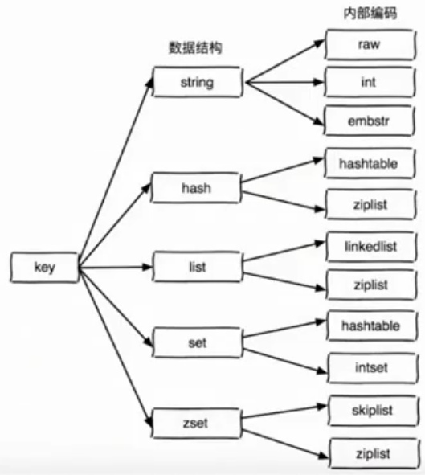

- RedisObject

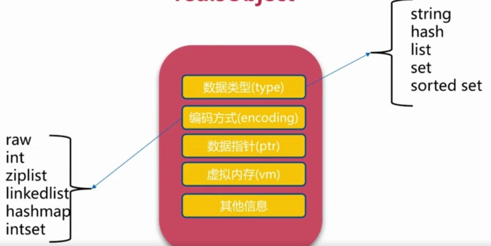

## （三）单线程


> 单线程为什么这么快？
>
> 1. 纯内存
> 2. 非阻塞IO
> 3. 避免线程切换和竞态消耗 

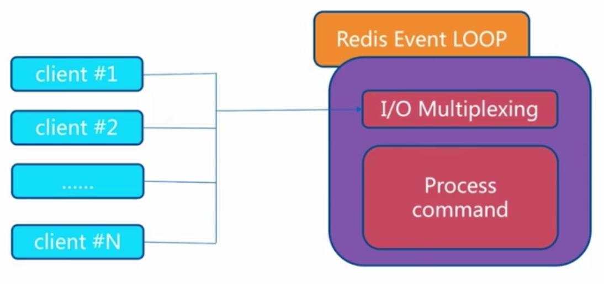

## （四）字符串

### 1.字符串键值结构

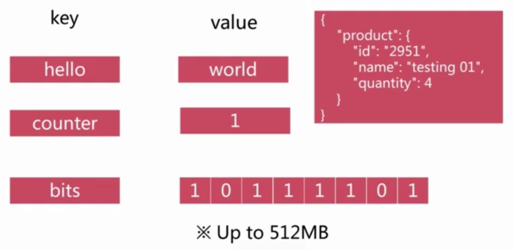

### 2.使用场景

- 缓存
- 计数器
- 分布式锁

### 3.get、set、del

```shell
get key
# 获取key对应的value
===============================
set key value
# 设置key-value
===============================
del key
# 删除key-value
```

```shell
127.0.0.1:6379> set hello "world"
OK
127.0.0.1:6379> get hello
"world"
127.0.0.1:6379> del hello
(integer) 1
127.0.0.1:6379> get hello
nil
```

### 4.incr、decr、incrby、decrby

```shell
incr key       时间复杂度 o(1)
# key自增1，如果key不存在，自增后get(key)=1    
=====================================================
decr key       时间复杂度 o(1)
# key自减1，如果可以不存在，自减后get(key)=-1
=====================================================
incrby key k     时间复杂度o(1)
# key自增k，如果key不存在，自增后get(key)=k
=====================================================
decr key k       时间复杂度o(1)
# key自减k，如果key不存在，自减后get(key)=-k
```

```shell
127.0.0.1:6379> get counter
(nil)
127.0.0.1:6379> incr counter
(integer) 1
127.0.0.1:6379> get counter
"1"
127.0.0.1:6379> incrby counter 99
(integer) 100
127.0.0.1:6379> decr counter
(integer) 99
127.0.0.1:6379> get counter
"99"
```

### 5.实战

#### （1）查找视频

```java
public VideoInfo get(long id){
    String redisKey = redisPrefix + id;
    VideoInfo videoInfo = redis.get(redisKey);
    if(videoInfo == null){
        videoInfo = mysql.get(id);
        if(videoInfo != null){
            //序列化
            redis.set(redisKey,serialize(videoInfo));
        }
    }
    return videoInfo;
}
```

#### （2）分布式id生成器

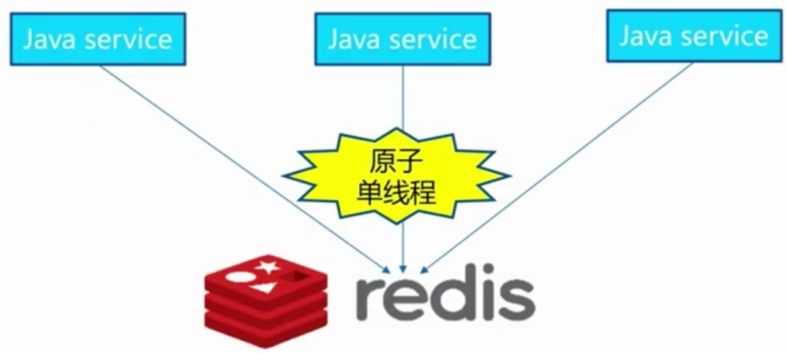

### 6. set、setnx、setxx

```shell
set key value 		时间复杂度 o(1)
# 不管key是否存在，都设置
======================================
setnx key value		时间复杂度 o(1)
# key不存在，才设置
======================================
set key value xx	时间复杂度 o(1)
# key存在，才设置
```

```shell
127.0.0.1:6379>  exists php
(integer) 0
127.0.0.1:6379>  set php good
OK
127.0.0.1:6379> setnx php bad
(integer) 0
127.0.0.1:6379> set php best xx
OK
127.0.0.1:6379> get php
"best"
127.0.0.1:6379> exists java
(integer) 0
127.0.0.1:6379> setnx java best
(integer) 1
127.0.0.1:6379> set java easy xx
OK
127.0.0.1:6379> get java
"easy"
127.0.0.1:6379>  exists lua
(integer) 0
127.0.0.1:6379> set lua hehe xx
(nil)
```

### 7.mget、mset

```shell
mget key1 key2 key3...		时间复杂度o(n)
# 批量获取key，原子操作
===========================================
mset key1 value1 key2 value2 key3 value3		时间复杂度o(n)
# 批量设置key-value
```

```shell
127.0.0.1:6379> mset hello world java best php good
OK
127.0.0.1:6379> mget hello java php
1) "world"
2) "best"
3) "good"
```

### 8.n次get 和 1次mget


### 9.getset、append、strlen

```shell
getset key newvalue			时间复杂度o(1)
# set key newvalue并返回旧的value
=================================================
append key value		时间复杂度o(1)
# 将value追加到旧的value
=================================================
strlen key		时间复杂度o(1)
# 返回字符串的长度(注意中文)
```

```shell
127.0.0.1:6379> set hello world
OK
127.0.0.1:6379> getset hello php
"world"
127.0.0.1:6379> append hello ",java"
(integer) 8
127.0.0.1:6379> get hello
"php,java"
127.0.0.1:6379> strlen hello
(integer) 8
127.0.0.1:6379> set hello "足球"
OK
127.0.0.1:6379> strlen hello
(integer) 4
```

### 10.incrbyfloat、getrange、setrange

```shell
incrbyfloat key 3.5		o(1)
# 增加key对应的值3.5
==========================================
getrange key start end		o(1)
# 获取字符串指定下标所有的值
==========================================
setrange key index value		o(1)
# 设置指定下标所有对应的值
```

```shell
127.0.0.1:6379> incr counter
(integer) 1
127.0.0.1:6379> incrbyfloat counter 1.1
"2.1"
127.0.0.1:6379> get counter
"2.1"
127.0.0.1:6379> set hello javabest
OK
127.0.0.1:6379> getrange hello 0 2
"jav"
127.0.0.1:6379> setrange hello 4 p
(integer) 8
127.0.0.1:6379> get hello
"javapest"
```

### 11.字符串总结

| 命令          | 含义                         | 复杂度（服务端开销） |
| ------------- | ---------------------------- | -------------------- |
| set key value | 设置key-value                | o(1)                 |
| get key       | 获取key-value                | o(1)                 |
| del key       | 删除key-value                | o(1)                 |
| setnx setxx   | 根据key是否存在设置key-value | o(1)                 |
| incr decr     | 计数                         | o(1)                 |
| mget mset     | 批量操作key-value            | o(n)                 |

## （五）hash

### 1.哈希键值结构

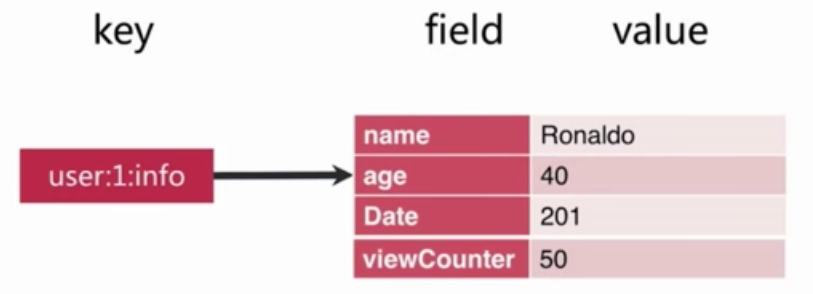

 ### 2.hget、hset、hdel

```shell
hget key field		时间复杂度o(1)
# 获取hash key对应的field的value
==========================================
hset key field value		时间复杂度o(1)
# 设置hash key对应field的value
==========================================
hdel key field		时间复杂度o(1)
# 删除hash key对应field的value
```

```shell
127.0.0.1:6379> hset user:1:info age 23
(integer) 1
127.0.0.1:6379> hget user:1:info age
"23"
127.0.0.1:6379> hset user:1:info name ronaldo
(integer) 1
127.0.0.1:6379> hgetall user:1:info
1) "age"
2) "23"
3) "name"
4) "ronaldo"
127.0.0.1:6379> hdel user:1:info age
(integer) 1
127.0.0.1:6379> hgetall user:1:info 
1) "name"
2) "ronaldo"
```

### 3.hexists、hlen

```shell
hexists key field		时间复杂度o(1)
# 判断hash 可以是否有field
========================================
hlen key		时间复杂度o(1)
# 获取hash key field的数量
```

```shell
127.0.0.1:6379> hgetall user:1:info
1) "name"
2) "ronaldo"
3) "age"
4) "23"
127.0.0.1:6379> hexists user:1:info name
(integer) 1
127.0.0.1:6379> hlen user:1:info
(integer) 2
```

### 4.hmget、hmset

```shell
hmget key field1 field2... fieldN		时间复杂度o(n)
# 批量获取hash key的一批field对应的值
===========================================================================
hmset key field1 value1 field2 value2...fieldN valueN		时间复杂度o(n)
# 批量设置hash key的一批field value
```

```shell
127.0.0.1:6379> hmset user:2:info age 30 name kaka page 50
OK
127.0.0.1:6379>  hlen user:2:info
(integer) 3
127.0.0.1:6379> hmget user:2:info age name	
1) "30"
2) "kaka"
```

### 5.实战

#### （1）记录网站每个用户个人主页的访问量

```
hincrby user:1:info pageview count
```

#### （2）缓存视频的基本信息（数据源在mysql中）伪代码

```java
public VideoInfo get(long id){
    String redisKey = redisPrefix + id;
    Map<String,String> hashMap = redis.hgetAll(redisKey);
    VideoInfo videoInfo = transferMapToVideo(hashMap);
    if(videoInfo == null){
        videoInfo = mysql.get(id);
        if(videoInfo != null){
            redis.hmset(redisKey,transferVideoToMap(videoInfo))
        }
    }
    return videoInfo;
}
```

### 6.hgetAll、hvals、hkeys

```shell
hgetall key		时间复杂度o(n)
# 返回hash key对应所有的field和value
========================================
hvals key		时间复杂度o(n)
# 返回hash key对应所有field的value
========================================
hkeys key		时间复杂度o(n)
# 返回hash key对应所有field
```

```shell
127.0.0.1:6379> hgetall user:2:info
1) "age"
2) "30"
3) "mame"
4) "kaka"
5) "page"
6) "50"
127.0.0.1:6379> hvals user:2:info
1) "30"
2) "kaka"
3) "50"
127.0.0.1:6379> hkeys user:2:info
1) "age"
2) "name"
3) "page"
```

### 7.String和hash相似API


## （六）list

 ### 1.列表结构(有序，可重复，两边插入弹出)

##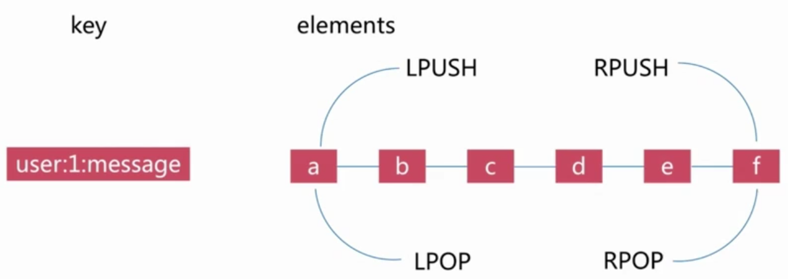 

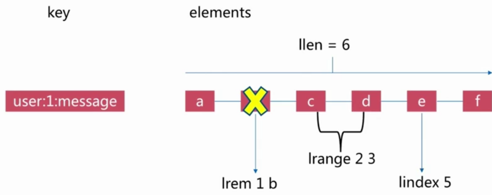

### 2.rpush

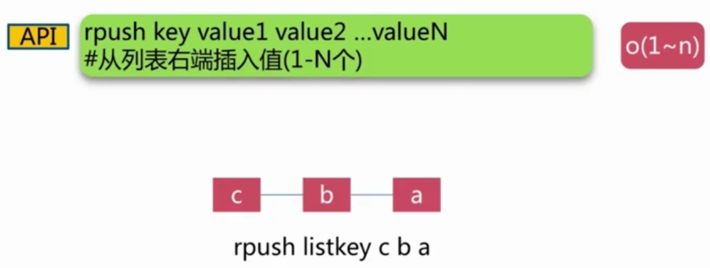

### 3.lpush


### 4.linsert

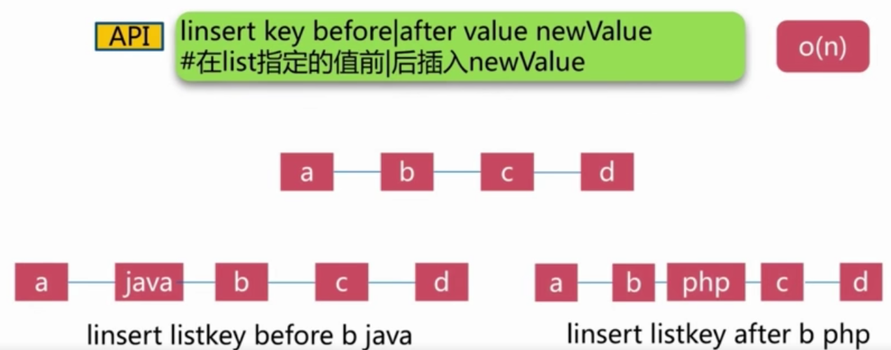

### 5.lpop

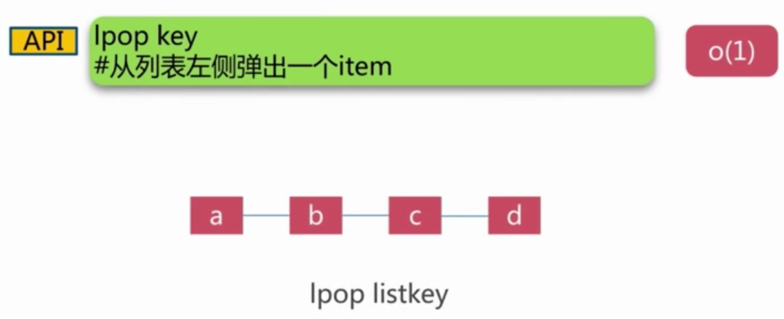

### 6.rpop


### 7.lrem

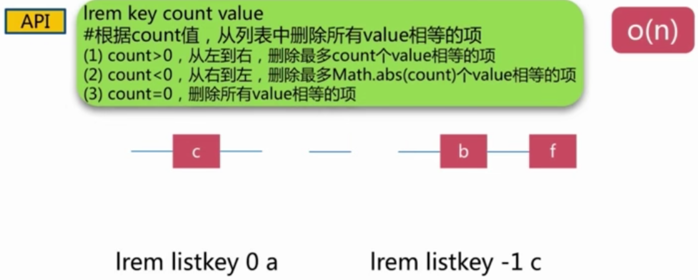

### 8.ltrim

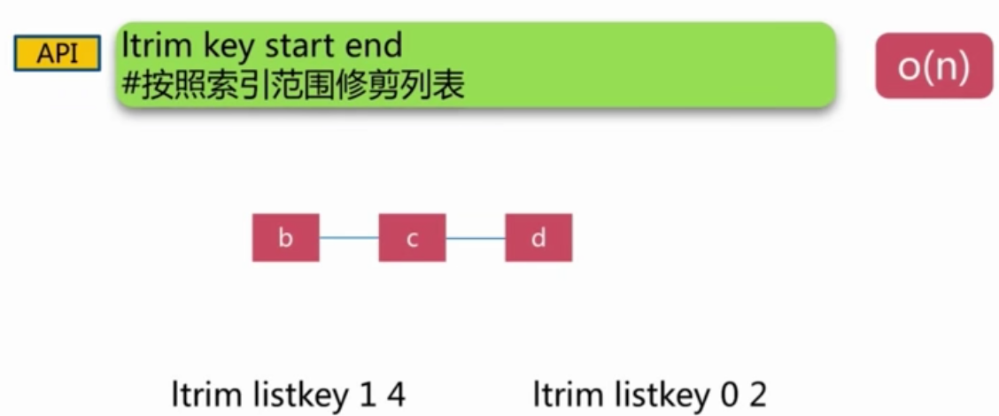

### 9.lrange

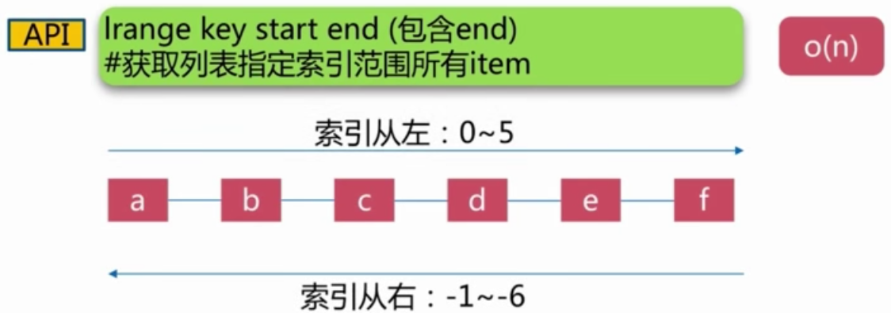

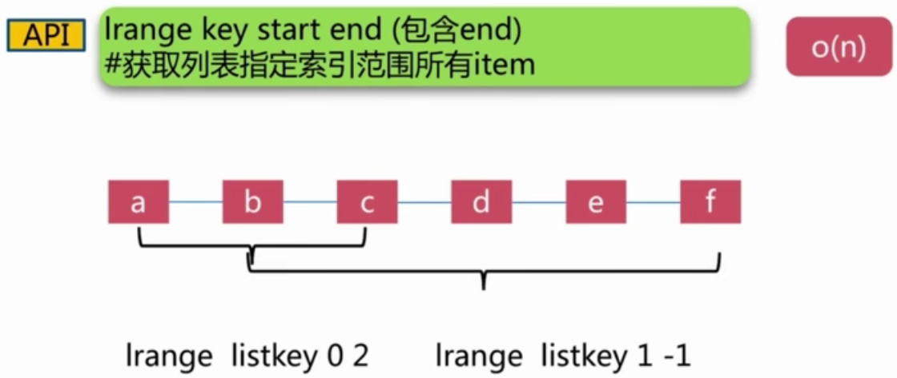

### 10.lindex

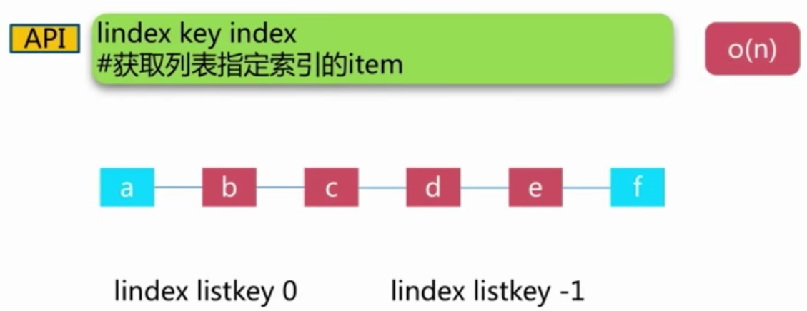

### 11.llen

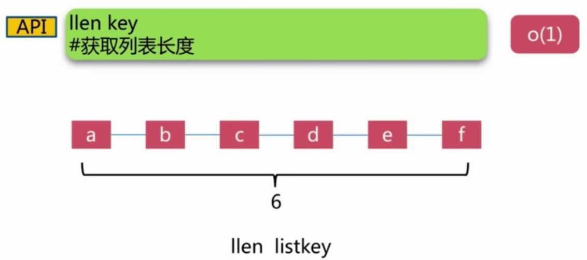

### 12.lset

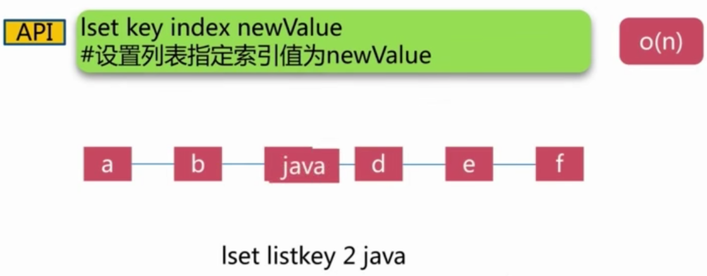

### 13.操作

```shell
127.0.0.1:6379> rpush mylist a b c
(integer) 3
127.0.0.1:6379> lrange listkey 0 -1
1) "a"
2) "b"
3) "c"
127.0.0.1:6379> lpush listkey 0
(integer) 4
127.0.0.1:6379> lrange listkey 0 -1
1) "0"
2) "a"
3) "b"
4) "c"
127.0.0.1:6379> rpop listkey
"c"
127.0.0.1:6379> lrange listkey 0 -1
1) "0"
2) "a"
3) "b"
```

### 14.blpop、brpop

```shell
blpop key timeout		时间复杂度o(1)
# lpop阻塞版本，timeout是阻塞超时时间，timeout=0为永远不阻塞
=======================================================
brpop key timeout		时间复杂度o(1)
# rpop阻塞版本，timeout是阻塞超时时间，timeout=0为永远不阻塞
```

### 15.TIPS

1. LPUSH + LPOP =Stack
2. LPUSH + RPOP = Quene
3. LPUSH + LTRIM = Capped Collection
4. LPUSH + BRPOP = Message Queue

## （七）set（无序、无重复、集合间操作）

### 1.集合结构


### 2.sadd、srem

```shell
sadd key element		时间复杂度o(1)
# 向集合key添加element(如果element已经存在，添加失败)
===================================================
srem key element		时间复杂度o(1)
# 将集合key中的element移除掉
```

### 3.scard、sismember、srandmember、smember


> smember：无序、小心使用（全部取出）
>
> srandmember和spop
>
> > 1. spop从集合弹出
> > 2. srandmember不会破坏集合

### 4.实战

```shell
127.0.0.1:6379> sadd user:1:follow it news his sports
(integer) 4
127.0.0.1:6379> smembers user:1:follow
1) "news"
2) "his"
3) "it"
4) "sports"
127.0.0.1:6379> spop user:1:follow
"news"
127.0.0.1:6379> smembers user:1:follow
1) "his"
2) "it"
3) "sports"
127.0.0.1:6379> scard user:1:follow
(integer) 3
127.0.0.1:6379> sismember user:1:follow entertainment
(integer) 0
```

### 5.sdiff、sinter、sunion（集合间API）


### 6.TIPS

SADD = Tagging

SPOP/SRANDMEMBER = Random item

SADD + SINTER = Social Graph

## （八）zset

### 1.有序集合结构


### 2.集合VS有序集合


### 3.列表VS有序集合


### 4.zadd

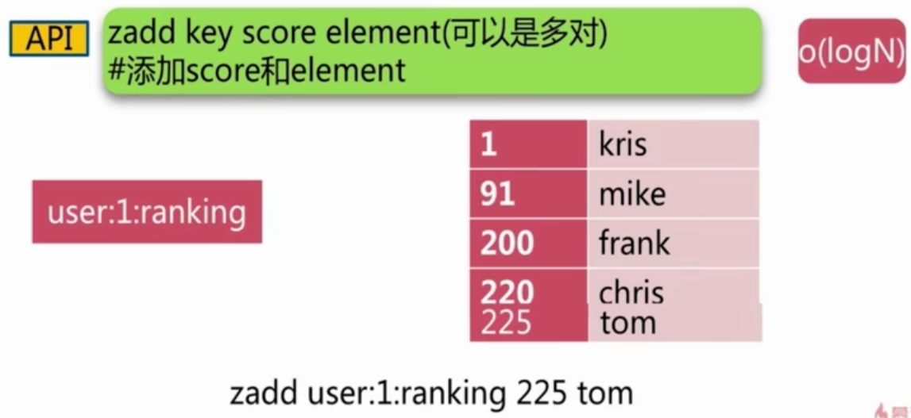

### 5.zrem

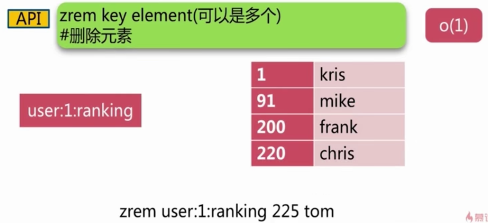

### 6.zscore

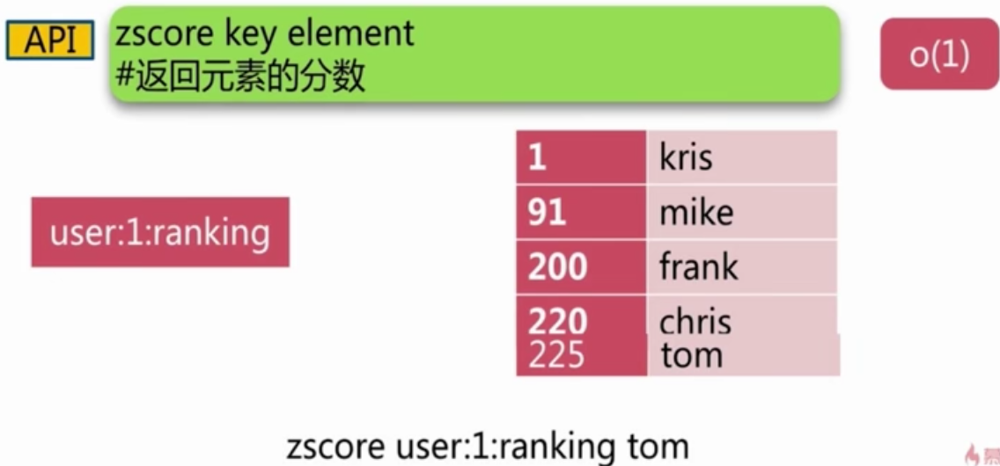

### 7.zincrby

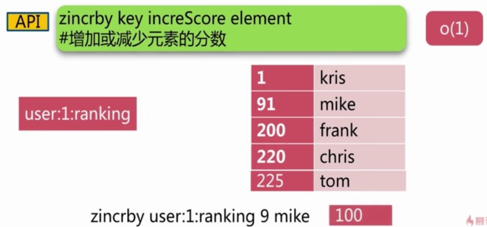

### 8.zcard

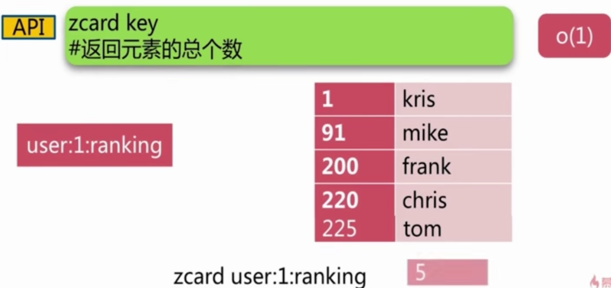

```shell
127.0.0.1:6379> zadd player:rank 1000 james 900 kobe 800 wade 600 bosh
(integer) 4
127.0.0.1:6379> zscore player:rank bosh
"600"
127.0.0.1:6379> zcard player:rank
(integer) 4
127.0.0.1:6379> zrank player:rank james
(integer) 3
127.0.0.1:6379> zrem player:rank kobe
(integer) 1
127.0.0.1:6379> zrange player:rank 0 -1 withscores
1) "bosh"
2) "600"
3) "wade"
4) "800"
5) "james"
6) "1000"
```

### 9.zrange

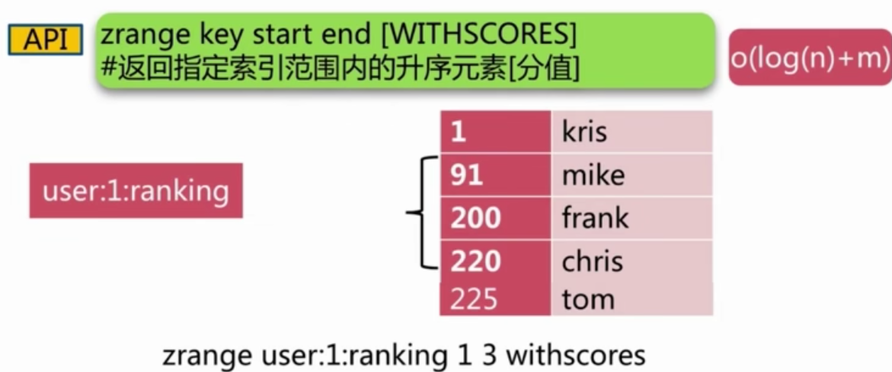

### 10.zrangebyscore


### 11.zcount

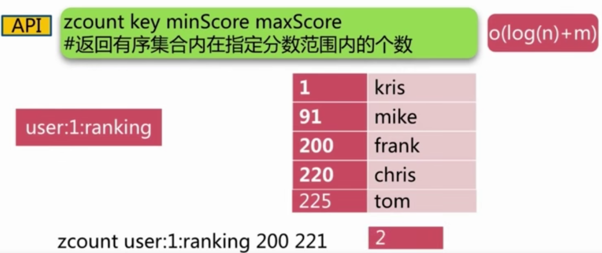

### 12.zremrangebyrank

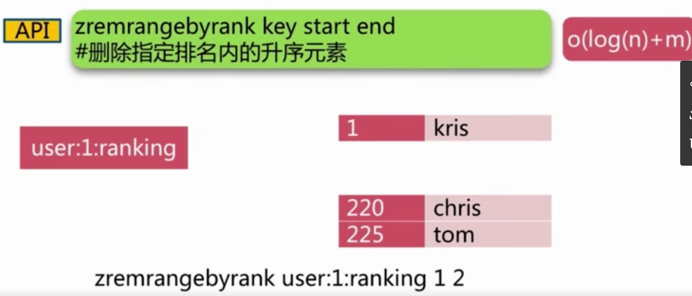

### 13.zremrangebyscore


```shell
127.0.0.1:6379> zadd player:rank 1000 ronaldo 900 messi 800 c-ronaldo 600 kaka
(integer) 4
127.0.0.1:6379> zrange player:rank 0 -1
1) "kaka"
2) "c-ronaldo"
3) "messi"
4) "ronaldo"
127.0.0.1:6379> zcount player:rank 700 901
(integer) 2
127.0.0.1:6379> zrangebyscore player:rank 700 901
1) "c-ronaldo"
2) "messi"
127.0.0.1:6379> zremrangeburank player:rank 0 1
(integer) 2
127.0.0.1:6379> zrange player:rank 0 -1
1) "messi"
2) "ronaldo"
127.0.0.1:6379> zrange player:rank 0 -1 withscores
1) "messi"
2) "900"
3) "ronaldo"
4) "1000"
```

### 14.查缺补漏

| 命令             | 说明               |
| ---------------- | ------------------ |
| zrevrank         | 按照从高到低排名   |
| zrevrange        | 从高到低取值       |
| zrevrangebyscore | 分数从高到低的结果 |
| zinterstore      | 对两个集合进行交集 |
| zunionstore      | 对两个集合进行并集 |

# 三、Redis客户端

## （一）Jedis (Java客户端)

### 1. Jedis获取

```xml
<dependency>
    <groupId>redis.clients</groupId>
    <artifactId>jedis</artifactId>
    <version>2.9.0</version>
    <type>jar</type>
    <scope>compile</scope>
</dependency>
```

### 2. Jedis直连

```java
// 1.生成一个Jedis对象，这个对象负责和指定Redis节点进行通讯
Jedis jedis = new Jedis("127.0.0.1",6379);
// 2.jedis执行set操作
jedis.set("hello","world");
// 3.jedis执行get操作，value=“world”
String value = jedis.get("hello");

Jedis(String host,int port,int connectionTimeout,int soTimeout)
- host：Redis节点的所在机器的IP
- port：Redis节点的端口
- connectionTimeout：客户端连接超时
- soTimeout：客户端读写超时    
```

### 3. 简单使用

```java
// 1.String
// 输出结果：OK
jedis.set("hello","world");
// 输出结果：world
jedis.get("hello");
// 输出结果：1
jedis.incr("counter");

// 2.hash
jedis.hset("myhash","f1","v1");
jedis.hset("myhash","f2","v2");
// 输出结果：{f1=v1,f2=v2}
jedis.hgetAll("myhash");

// 3.list
jedis.rpush("mylist","1");
jedis.rpush("mylist","2");
jedis.rpush("mylist","3");
// 输出结果：[1,2,3]
jedis.lrange("mylist",0,-1);

// 4.set
jedis.sadd("myset","a");
jedis.sadd("myset","b");
jedis.sadd("myset","a");
// 输出结果：[b,a]
jedis.smembers("myset");

// 5.zset
jedis.zadd("myzset",99,"tom");
jedis.zadd("myzset",66,"peter");
jedis.zadd("myzset",33,"james");
// 输出结果：[[["james"],33,0],["peter"],66,0],[["tom"],99,0]]
jedis.zrangeWithScores("myzset",0,-1);
```

### 4. Jedis连接池使用

#### （1）Jedis直连

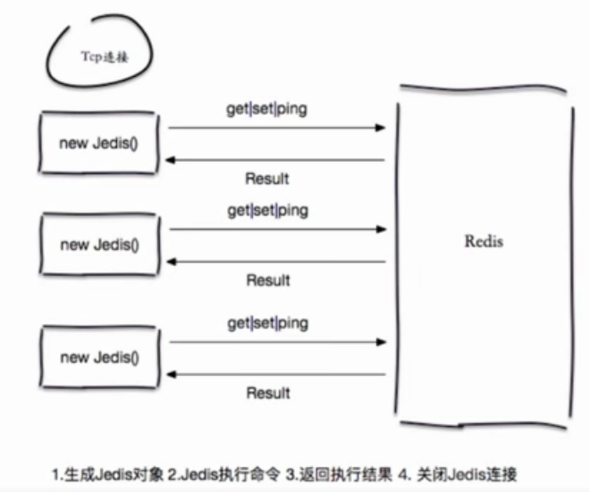

#### （2）Jedis连接池

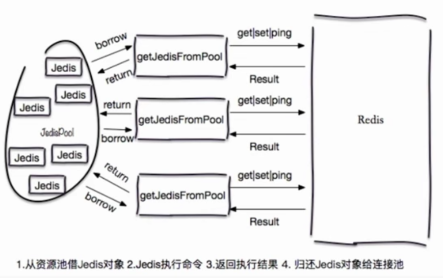

```java
// 初始化Jedis连接池，通常来讲JedisPool是单例的。
GenericObjectPoolConfig poolConfig = new GenericObjectPoolConfig();
JedisPool jedisPool = new JedisPool(poolConfig,"127.0.0.1","6379");

Jedis jedis = null;
try{
    // 1.从连接池获取jedis对象
    jedis = jedisPool.getResource();
    // 2.执行操作
    jedis.set("hello","world");
}catch(Exception e){
    e.printStackTrace();
}finally{
    if(jedis != null){
        // 如果使用JedisPool，close操作不是关闭连接，代表归还连接池
        jedis.close();
    }
}
```

#### （3）方案对比

##### （a）Jedis直连

==优点：==

- 简单方便
- 适用于少量长期连接的场景

==缺点：==

- 存在每次新建/关闭TCP开销
- 资源无法控制，存在连接泄露的可能
- Jedis对象线程不安全

##### （b）Jedis连接池

==优点：==

- Jedis预先生成，降低开销使用
- 连接池的形式保护和控制资源的使用

==缺点：==

- 相对于直连接，使用相对麻烦，尤其在资源的管理上需要很多参数来保证，一旦规划不合理也会出现问题

# 四、Redis其他功能

## （一）慢查询

### 1. 生命周期

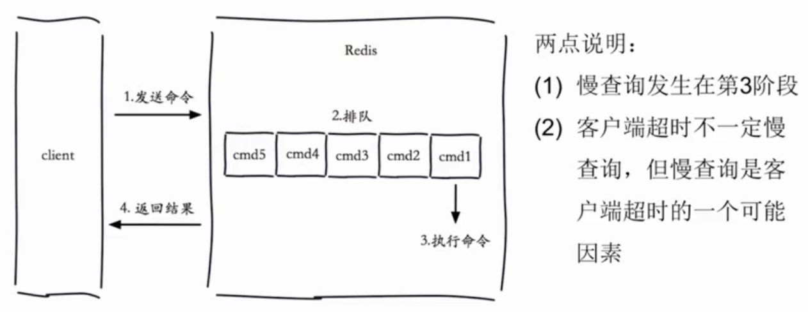

### 2. slowlog-max-len

1. 先进先出队列
2. 固定长度
3. 保存在内存中

### 3. slowlog-log-slower-than

1. 慢查询阈值（单位：微秒）
2. slowlog-log-slower-than=0，记录所有命令
3. slowlog-log-slower-than<0，不记录任何命令

### 4. 配置方法

1. 默认值

- config get slowlog-max-len = 128
- config get slowlog-log-slower-than = 10000

2. 修改配置文件重启
3. 动态配置

- config set slowlog-max-len 1000
- config set slowlog-log-slower-than 1000

### 5. 慢查询命令

1. slowlog get [n]：获取慢查询队列
2. slowlog len：获取慢查询队列长度
3. slowlog reset：清空慢查询队列

### 6. 运维经验

1. slowlog-max-len不要设置过大，默认10ms，通常设置1ms
2. slowlog-log-slower-than不要设置过小，通常设置1000左右
3. 理解命令的生命周期
4. 定期持久化慢查询

## （二）pipeline

### 1. 什么是流水线

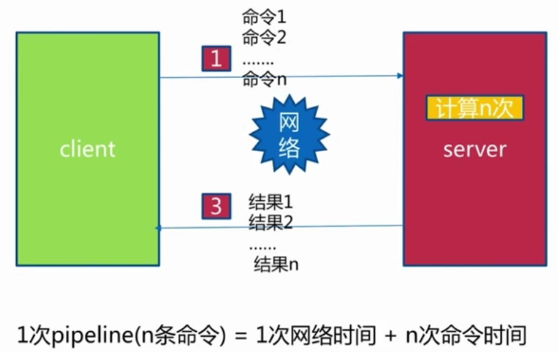

### 2. 流水线的作用

| 命令   | N个命令操作       | 1次pipeline(n个命令) |
| ------ | ----------------- | -------------------- |
| 时间   | n次网络 + n次命令 | 1次网络 + n次命令    |
| 数据量 | 1条命令           | n条命令              |

1. Redis的命令时间是微秒级别的。
2. pipeline每次条数要控制（网络）。

### 3. pipeline-Jedis实现

```xml
<dependency>
    <groupId>redis.clients</groupId>
    <artifactId>jedis</artifactId>
    <version>2.9.0</version>
    <type>jar</type>
    <scope>compile</scope>
</dependency>
```

#### （1）没有pipeline

```java
Jedis jedis = new Jedis("127.0.0.1",6379);
for(int i = 0;i < 10000;i++){
    jedis.hset("hashkey:" + i,"field" + i,"value" + i);
}

1W hset --->  50s
```

#### （2）使用pipeline

```java
Jedis jedis = new Jedis("127.0.0.1",6379);
for(int i = 0;i < 100;i++){
    Pipeline pipeline = jedis.pipelined();
    for(int j = i * 100;j < (i+1) * 100;j++){
        pipeline.hset("hashkey:" + j,"field" + j,"value" + j);
    }
    pipeline.syncAndReturnAll();
}

1W hset --->  0.7s
```

### 4. 使用建议

1. 注意每次pipeline携带数据量
2. pipeline每次只能作用在一个Redis节点上
3. M操作与pipeline区别

## （三）发布订阅

### 1. 角色

- 发布者(publusher)
- 订阅者(subscriber)
- 频道(channel)

### 2. 模型

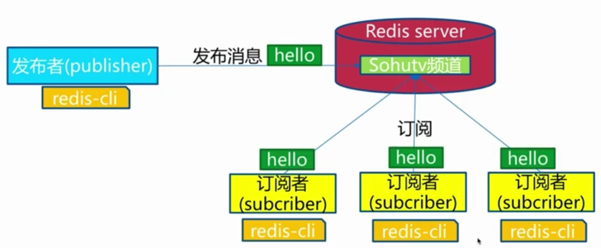

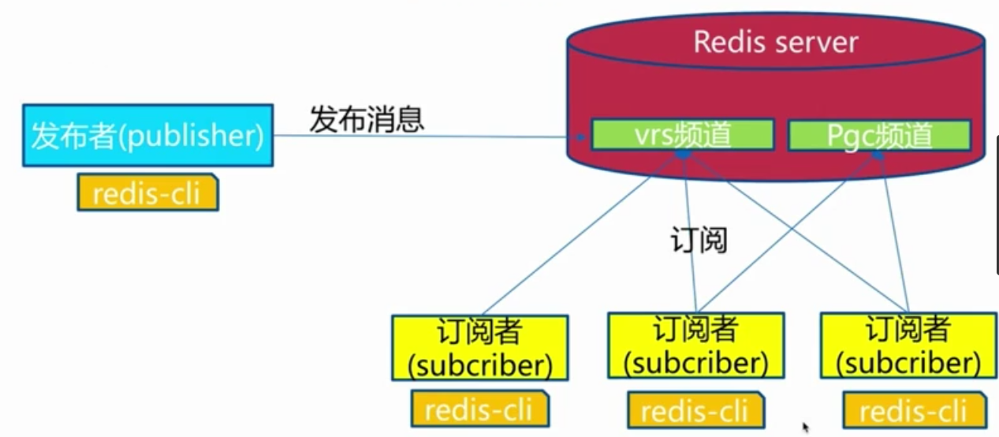

### 3. publish(发布命令)

```shell 
publish channel message
```

```shell
redis> publish sohu:tv "hello world"
(integer) 3 #订阅者个数
redis> publish sohu:auto "taxi"
(integer)
```

### 4. subscribe(订阅)

```shell
subscribe [channel] #一个或多个
```

```shell
redis> subscribe sohu:tv
1) "subscribe"
2) "sohu:tv"
3) (integer) 1
1) "message"
2) "sohu:tv"
3) "hello world"
```

### 5. unsubscribe(取消订阅)

```shell
unsubscribe [channel] #一个或多个
```

```sh
redis> unsubscribe sohu:tv
1) "unsubscribe"
2) "sohu:tv"
3) (integer) 0
```

### 6. 其他API

```shell
1. psubscribe [pattern...]		# 订阅模式
2. punsubscribe [pattern...]	# 退出指定的模式
3. pubsub channels	# 列出至少有一个订阅者的频道
4. pubsub numsub [channel...]	# 列出给定频道的订阅者数量
5. pubsub numpat	# 列出被订阅模式的数量
```

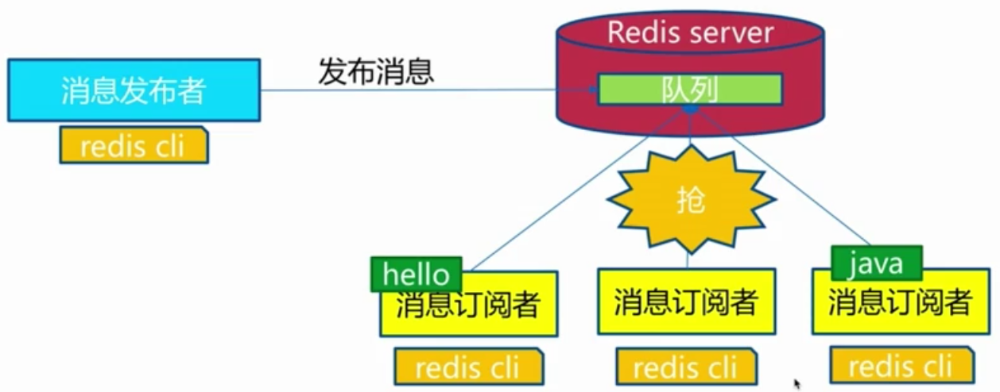

## （四）BitMap

### 1. 位图

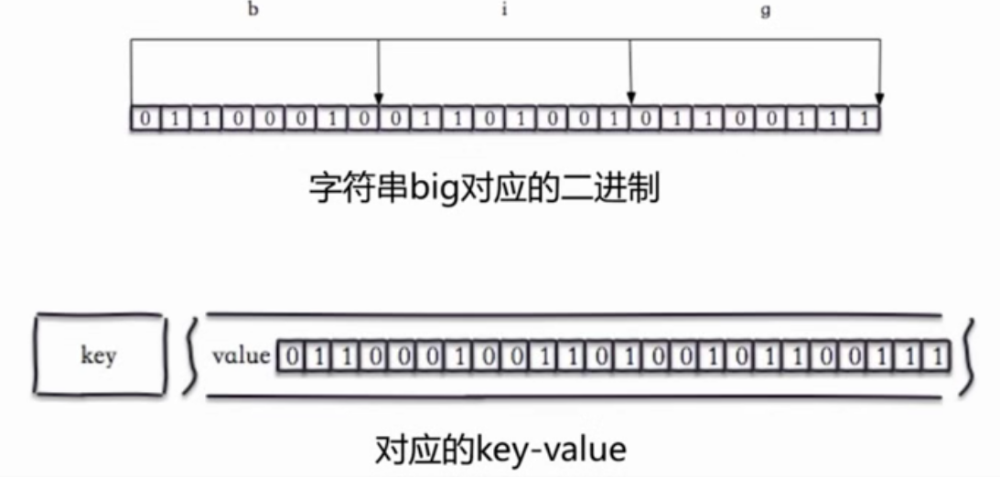

### 2. setbit

```shell
setbit key offset value
# 给位图指定索引设置值
```

```shell
127.0.0.1:6379> setbit unique:users:2016-04-05 0 1
(integer) 0
127.0.0.1:6379> setbit unique:users:2016-04-05 5 1
(integer) 0
127.0.0.1:6379> setbit unique:users:2016-04-05 11 1
(integer) 0
127.0.0.1:6379> setbit unique:users:2016-04-05 15 1
(integer) 0
127.0.0.1:6379> setbit unique:users:2016-04-05 19 1
(integer) 0
```

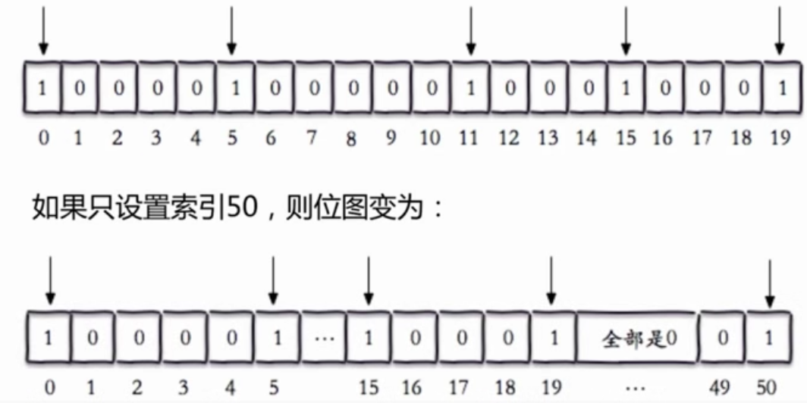

### 3. getbit

```shell
getbit key offset
# 获取位图指定索引的值
```

```shell
127.0.0.1:6379> getbit unique:users:2016-04-05 8
(intege) 0
127.0.0.1:6379> getbit unique:users:2016-04-05 19
(integer) 1
```

### 4. bitcount

```shell
bitcount key [start end]
# 获取位图指定范围(start到end，单位为字节，如果不指定就是获取全部)位置为1的个数
```

```shell
127.0.0.1:6379> bitcount unique:users：2016-04-05
(integer) 5
127.0.0.1:6379> bitcount unique:users：2016-04-05 1 3
(integer) 3
```

### 5. bitop

```shell
bitop op destkey key [key...]
# 做多个Bitmap的and(交集)、or(并集)、not(非)、xor(异或)操作并将结果保存在destkey中
```

```shell
# 求两个位图的并集
127.0.0.1:6379> bitop and unique:users:and:2016_04_04-2016_04_05 unique:users:2016-04-05 unique:users:2016-04-04
(integer) 3
127.0.0.1:6379> bitcount unique:users:and:2016_04_04-2016_04_05
(integer) 2
```

### 6. bitpos

```shell
bitpos key targetBit [start] [end]
# 计算位图指定范围(start到end，单位为字节，如果不指定就是获取全部)第一个偏移量对应的值等于targetBit的位置
```

```shell
127.0.0.1:6379> bitpos unique:users:2016-04-04 1
(integer) 1
127.0.0.1:6379> bitpos unique:users:2016-04-04 0 1 2
(integer) 8
```

### 7. 使用经验

1. type=string，最大512M
2. 注意setbit时的偏移量，可能有较大耗时
3. 位图不是绝对好

## （五）HyperLogLog

### 1. 概念

1. 基于HyperLogLog算法：极小空间完成独立数量统计。
2. 本质还是字符串

```shell
127.0.0.1:6379> type hyperloglog_key
string
```

### 2. API

```shell
1. pfadd key element [element ...]：向hyperloglog添加元素
2. pfcount key [key ...]：计算hyperloglog的独立总数
3. pfmerge destkey sourcekey [sourcekey ...]：合并多个hyperloglog
```

```shell
127.0.0.1:6379> pfadd 2017_03_06:unique:ids "uuid-1" "uuid-2" "uuid-3" "uuid-4"
(integer) 1
127.0.0.1:6379> pfcount 2017_03_06:unique:ids
(integer) 4
127.0.0.1:6379> pfadd 2017_03_06:unique:ids "uuid-1" "uuid-2" "uuid-3" "uuid-90"
(integer) 1
127.0.0.1:6379> pfcount 2017_03_06:unique:ids
(integer) 5

127.0.0.1:6379> pfadd 2016_03_06:unique:ids "uuid-1" "uuid-2" "uuid-3" "uuid-4"
(integer) 1
127.0.0.1:6379> pfcount 2016_03_06:unique:ids
(integer) 4
127.0.0.1:6379> pfadd 2017_03_05:unique:ids "uuid-4" "uuid-5" "uuid-6" "uuid-7"
(integer) 1
127.0.0.1:6379> pfcount 2016_03_05:unique:ids
(integer) 4
127.0.0.1:6379> pfmerge 2016_03_05_06:unique:ids 2016_03_05:unique:ids 2016_03_06:unique:ids
(integer) 7
```

## （六）GEO

### 1. geoadd

```shell
geo key longitude latitude	member [longitude latitude member ...] 
# 增加地理位置信息
```

```shell
127.0.0.1:6379> geoadd cities:locations 116.28 39.55 beijing
(integer) 1
127.0.0.1:6379> geoadd cities:locations 116.28 39.55 beijing
(integer) 1
127.0.0.1:6379> geoadd cities:locations 117.12 39.08 tianjin 114.29 38.02 shijiazhuang 118.01 39.38 tangshan 115.29 38.51 baoding
(integer) 4
```

### 2. geopos

```shell
geopos key member [member ...]
# 获取地理位置信息
```

```shell
127.0.0.1:6379> geopos cities:locations tianjin
1) 1) "117.12000042200088501"
   2) "39.0800000535766543"
```

### 3. geodist

```shell
geodist key member1 member2 [unit]
# 获取两个地理位置的距离
# unit:m(米)、km(千米)、mi(英里)、ft(尺)
```

```shell
127.0.0.1:6379> geodist cities:locations tianjin beijing km
"89.2061"
```

### 4. georadius

```shell
georadius key longitude latitude radiusm|km|ft|mi [withcoord] [withdist] [withhash] [COUNT count] [asc|desc] [store key][storedist key]

georadiusbymember key member  radiusm|km|ft|mi [withcoord]  [withdist] [withhash] [COUNT count] [asc|desc] [store key][storedist key]
# 获取指定位置范围内的地理位置信息集合

withcoord：返回结果中包含经纬度
withdist：返回结果中包含距离中心节点位置
withhash：返回结果中包含geohash
COUNT count：指定返回结果的数量
asc|desc：返回结果按照距离中心节点的距离做升序或者降序
store key：将返回结果的地理位置信息保存到指定键
storedist key：将返回结果距离中心节点的距离保存到指定键
```

```shell
127.0.0.1:6379> georadiusbymember cities:locations beijing 150 km
1) "beijing"
2) "tianjin"
3) "tangshan"
4) "baoding"
```

# 五、Redis持久化

## （一）持久化概述

> redis所有数据保存在内存中，对数据的更新将异步地保存到磁盘上

==持久化方式==

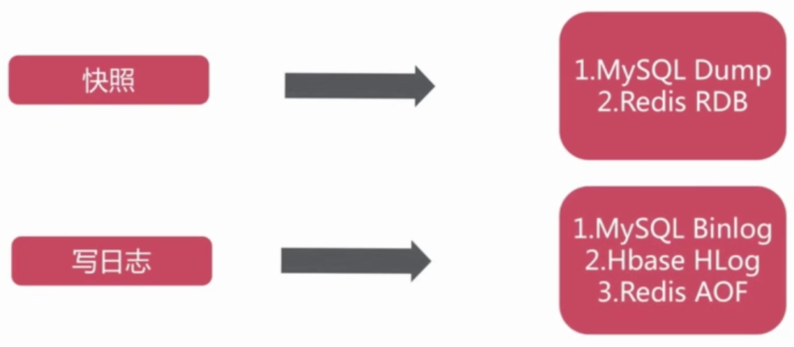

## （二）RDB

### 1. 什么是RDB

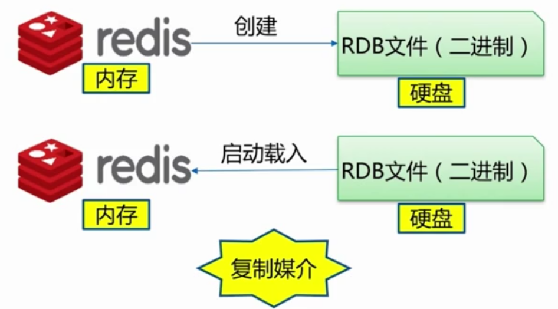

> ==触发机制-主要三种方式==
>
> 1. save(同步)
> 2. bgsave(异步)
> 3. 自动

### 2. save命令

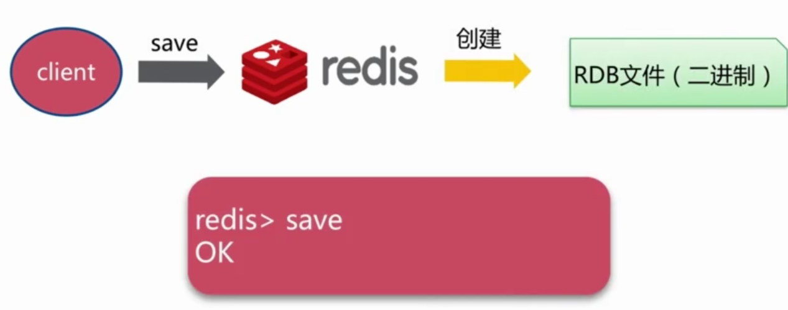

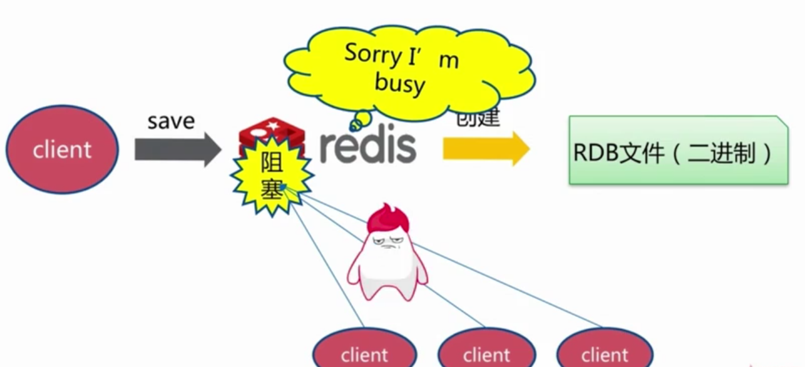


### 3.  bgsave命令

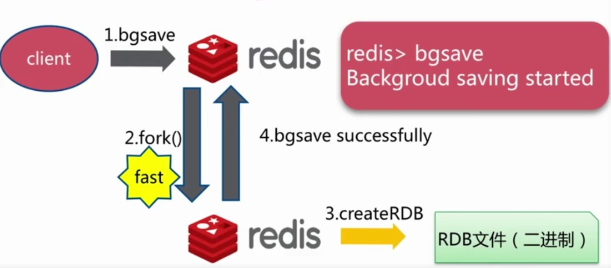

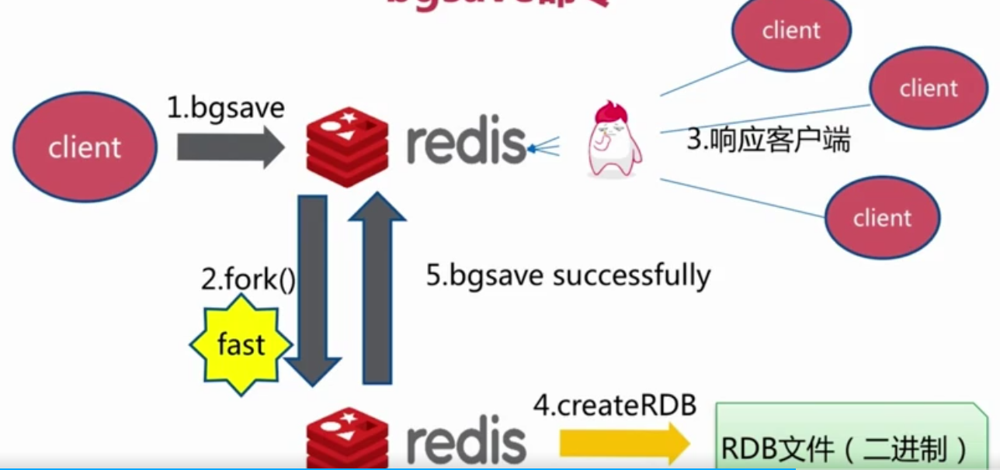


| 命令   | save             | bgsave               |
| ------ | ---------------- | -------------------- |
| IO类型 | 同步             | 异步                 |
| 阻塞？ | 是               | 是（阻塞发生在fork） |
| 复杂度 | O(n)             | O(n)                 |
| 优点   | 不会消耗额外内存 | 不阻塞客户端命令     |
| 缺点   | 阻塞客户端命令   | 需要fork，消耗内存   |

### 4. 自动生成RDB

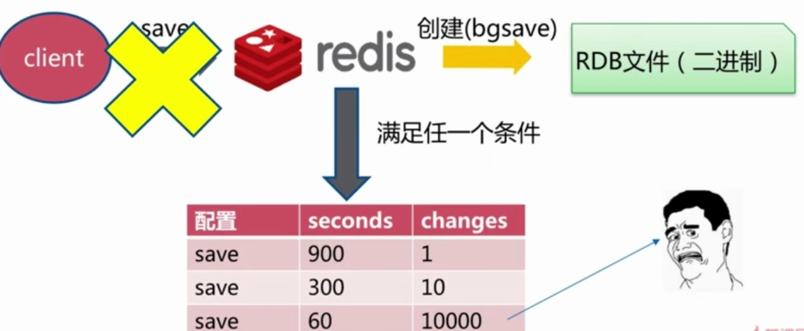

#### （1）配置

==配置==

```shell
save 900 1
save 300 10
save 60 10000
dbfilename dump.rdb
dir ./
stop-writes-on-bgsave-error yes
rdbcompression yes
rdbchecksum yes
```

==最佳配置==

```shell
dbfilename dump-${port}.rdb
dir /bigdiskpath
stop-writes-on-bgsave-error yes
rdbcompression yes
rdbchecksum yes
```

#### （2）触发机制-不容忽略方式

1. 全量复制
2. debug reload
3. shutdown